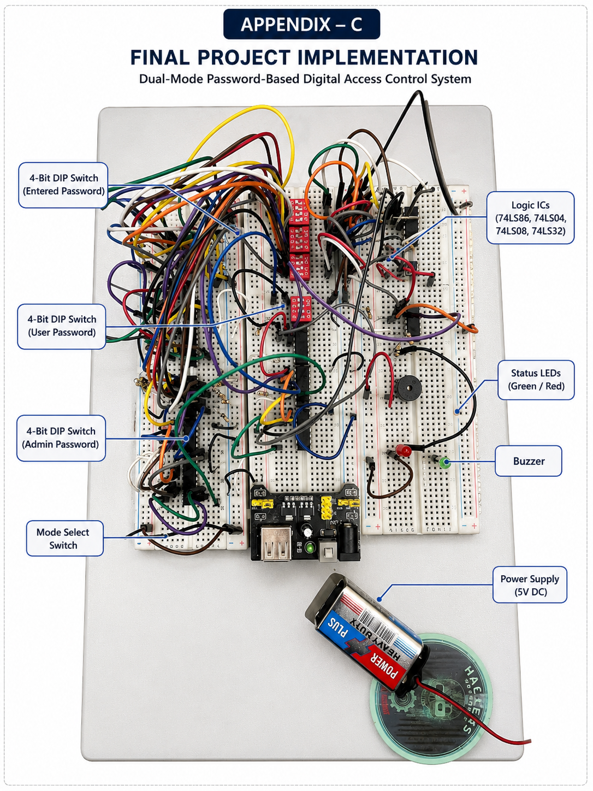
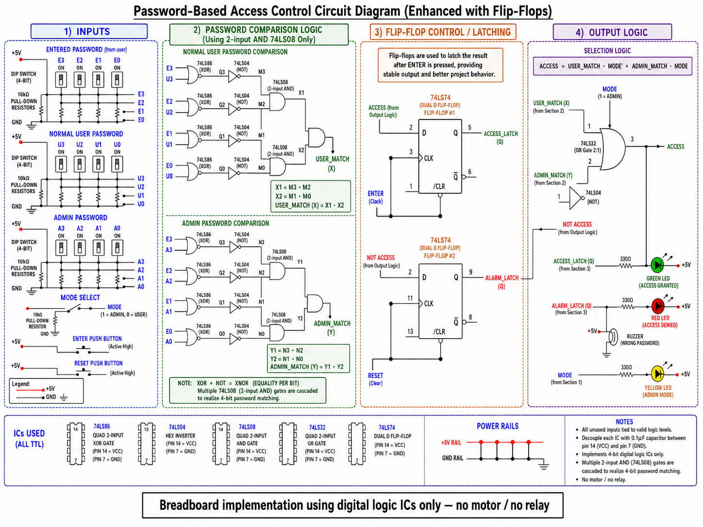
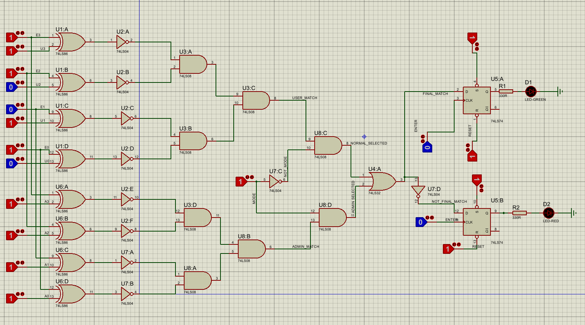

# Password-Based Digital Access Control System

A Digital Logic Design (DLD) project that implements a **Password-Based Digital Access Control System** using **TTL logic ICs** on a breadboard without using any microcontroller or programmable device.

This project demonstrates the practical implementation of combinational and sequential logic for password verification, access control, and alarm indication.

---

## 📖 Overview

The system verifies a 4-bit binary password entered through DIP switches. It supports two operating modes:

- Normal User Mode
- Admin Mode

The entered password is compared with the selected stored password using digital logic gates. When the password is correct, access is granted through a green LED. If the password is incorrect, a red LED and buzzer indicate access denial.

The final output is latched using a 74LS74 D Flip-Flop after pressing the ENTER button.

---

## ✨ Features

- 4-bit Binary Password Verification
- User and Admin Modes
- Breadboard Hardware Implementation
- Proteus Circuit Simulation
- Digital Logic Gate Based Design
- No Microcontroller Used
- Output Latching using D Flip-Flop
- Green LED for Access Granted
- Red LED and Buzzer for Access Denied
- Reset Function for New Password Entry

---

## 🛠 Components Used

### Logic ICs

- 74LS86 (XOR Gate)
- 74LS04 (Hex Inverter)
- 74LS08 (AND Gate)
- 74LS32 (OR Gate)
- 74LS74 (D Flip-Flop)

### Other Components

- Breadboard
- DIP Switches
- Push Buttons
- LEDs
- Buzzer
- 330Ω Resistors
- 10kΩ Pull-down Resistors
- Jumper Wires
- 5V Power Supply

---

## ⚙ Working Principle

1. The user enters a 4-bit binary password using DIP switches.
2. The circuit compares the entered password with the stored password.
3. XOR gates detect mismatched bits.
4. NOT gates generate equality outputs.
5. Cascaded AND gates determine whether all bits match.
6. User/Admin mode logic selects the appropriate password.
7. The ENTER button clocks the result into a D Flip-Flop.
8. Correct password:
   - Green LED ON
   - Access Granted
9. Wrong password:
   - Red LED ON
   - Buzzer Activated

---

## 💻 Software Used

- Proteus Design Suite

---

## 🔧 Hardware Implementation

The complete circuit was built and tested on a breadboard using TTL logic ICs.

---

## 📷 Project Images

### Breadboard



### Circuit Diagram



### Proteus Simulation




## 📂 Repository Structure

```
Password-Based-Digital-Access-Control-System
│
├── README.md
├── LICENSE
├── Proposal.pdf
├── DLD_Project_Report.pdf
├── Breadboard.jpg
├── Circuit.png
├── Proteus.png

```

---

## 🚀 Future Improvements

- Increase password length
- Matrix keypad input
- Seven-segment or LCD display
- Relay-controlled electronic door lock
- PCB implementation
- Debouncing circuit
- EEPROM-based password storage

---

## 👥 Authors

- **Aetisaam ul Hassan**
- Aman Sajid
- Maier Masood

Capital University of Science and Technology (CUST)

Department of Electrical and Computer Engineering

---

## 📄 Project Report

The complete project documentation is available in:

- `DLD_Project_Report.pdf`

---

## 📜 License

This project is licensed under the MIT License.
